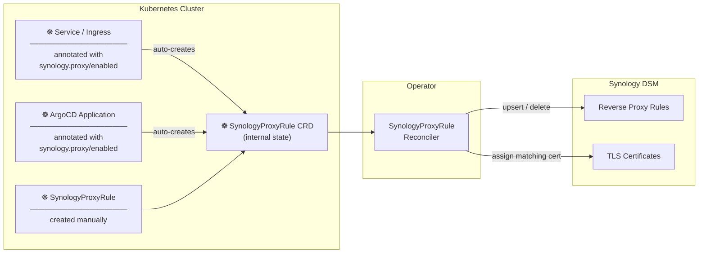
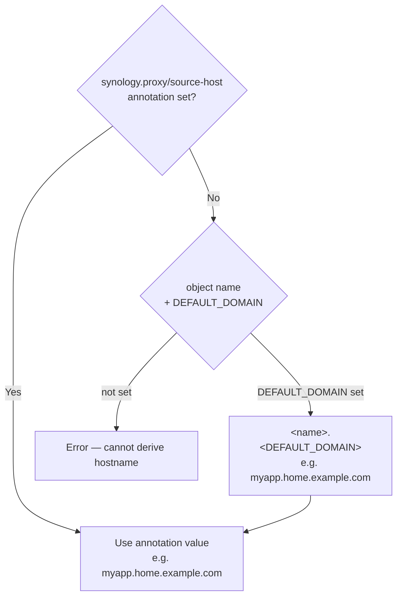
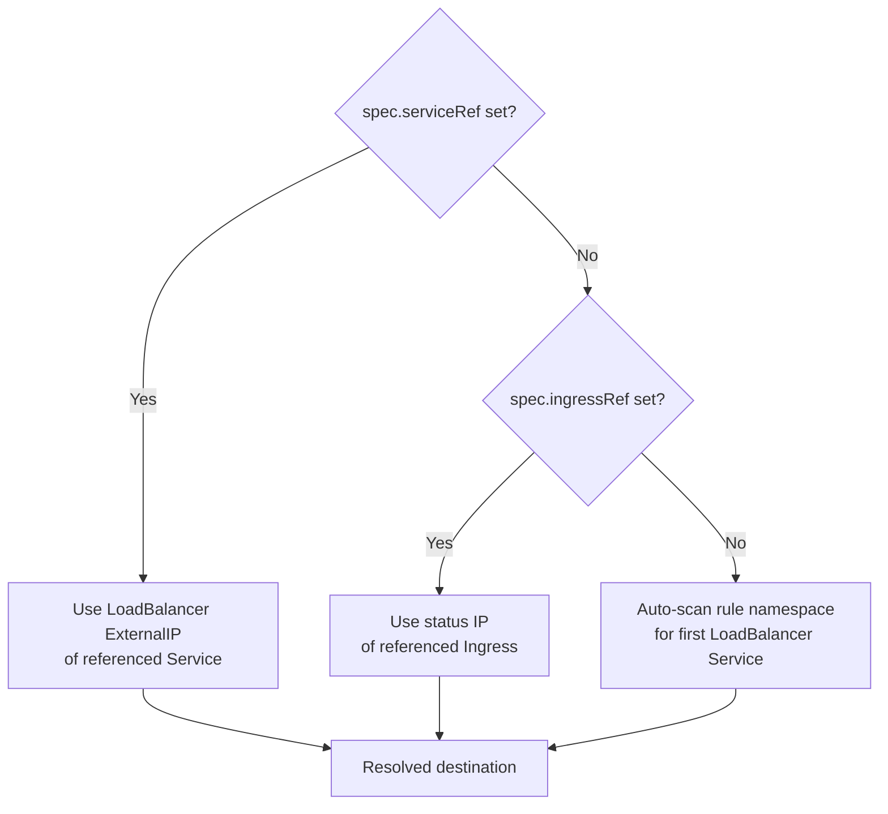

# Synology Proxy Operator

> **Deploy an app. Get a public hostname. Automatically.**
> No more clicking through Synology DSM menus every time something changes in your cluster.

[](https://github.com/phoeluga/synology-proxy-operator/actions/workflows/ci.yaml)
[](https://github.com/phoeluga/synology-proxy-operator/releases)
[](https://github.com/phoeluga/synology-proxy-operator/releases)
[](LICENSE)

---

You have a Synology NAS acting as your home lab's gateway. Every time you deploy a new service to Kubernetes, you open DSM, navigate to the reverse proxy settings, fill in the hostname, the backend IP, the port, assign a certificate — and repeat for the next service, and the next.

When a LoadBalancer IP changes, you update it manually. When you remove an app, you remember (or forget) to clean up the DSM rule.

**Synology Proxy Operator eliminates all of that.** It watches your Kubernetes cluster and keeps your Synology DSM reverse proxy configuration in sync — automatically, with TLS certificate assignment and zero manual steps.

---

## How it works



The operator runs three controllers:

| Controller | Watches | Action |
|---|---|---|
| `ServiceIngressReconciler` | Services + Ingresses with `synology.proxy/enabled: "true"` | Creates / deletes `SynologyProxyRule` objects |
| `ArgoApplicationReconciler` | ArgoCD `Application` objects with `synology.proxy/enabled: "true"` | Creates / deletes `SynologyProxyRule` objects |
| `SynologyProxyRuleReconciler` | All `SynologyProxyRule` objects | Syncs to DSM — the **only** controller that calls the DSM API |

The first two controllers are purely Kubernetes-side. All DSM interaction flows through the third.

---

## Prerequisites

| Requirement | Version |
|---|---|
| Synology DSM | ≥ 7.0 (WebAPI access required) |
| Kubernetes | ≥ 1.28 |
| ArgoCD | ≥ 2.8 — optional, only for the ArgoCD watcher |

---

## Installation

### Helm (recommended)

```bash
helm upgrade --install synology-proxy-operator \
  oci://ghcr.io/phoeluga/charts/synology-proxy-operator \
  --namespace synology-proxy-operator \
  --create-namespace \
  --set synology.url="https://192.168.1.x:5001" \
  --set synology.username="admin" \
  --set synology.password="secret" \
  --set synology.skipTLSVerify=true \
  --set operator.defaultDomain="home.example.com"
```

#### Using an existing Secret

If you manage credentials externally (SealedSecret, External Secrets Operator, etc.):

```bash
helm upgrade --install synology-proxy-operator \
  oci://ghcr.io/phoeluga/charts/synology-proxy-operator \
  --namespace synology-proxy-operator \
  --create-namespace \
  --set synology.existingSecret=synology-credentials \
  --set operator.defaultDomain="home.example.com"
```

The Secret must have keys: `SYNOLOGY_URL`, `SYNOLOGY_USER`, `SYNOLOGY_PASSWORD`, `SYNOLOGY_SKIP_TLS_VERIFY`.

### GitOps (ArgoCD multi-source)

```yaml
apiVersion: argoproj.io/v1alpha1
kind: Application
metadata:
  name: synology-proxy-operator
  namespace: argocd
spec:
  sources:
    - repoURL: https://github.com/phoeluga/synology-proxy-operator
      path: config
      targetRevision: main
    - repoURL: https://github.com/your-org/your-cluster-repo
      path: clusters/prod/infrastructure/synology-proxy-operator/credentials
      targetRevision: HEAD
  destination:
    server: https://kubernetes.default.svc
    namespace: synology-proxy-operator
```

The `credentials/` directory should contain a Secret (or SealedSecret) with the keys above.

---

## Configuration

All settings are read from environment variables. Helm sets these automatically from `values.yaml`. For local development, copy `.env.local.example` to `.env.local`.

| Variable | Description | Default |
|---|---|---|
| `SYNOLOGY_URL` | DSM base URL — e.g. `https://192.168.1.x:5001` | required |
| `SYNOLOGY_USER` | DSM username | required |
| `SYNOLOGY_PASSWORD` | DSM password | required |
| `SYNOLOGY_SKIP_TLS_VERIFY` | Skip TLS verification (self-signed certs) | `false` |
| `DEFAULT_DOMAIN` | Domain appended to auto-derived hostnames, e.g. `home.example.com` | `""` |
| `DEFAULT_ACL_PROFILE` | ACL profile applied when none is specified | `""` |
| `RULE_NAMESPACE` | Namespace where auto-created `SynologyProxyRule` objects are placed | `synology-proxy-operator` |
| `ENABLE_ARGO_WATCHER` | Enable the ArgoCD Application watcher | `true` |
| `WATCH_NAMESPACE` | Namespace or glob pattern (e.g. `app-*`) — all Services, Ingresses and ArgoCD Applications in matching namespaces are auto-managed without needing the `synology.proxy/enabled` annotation. Empty = annotation-only mode. | `""` |

---

## Usage

There are three ways to use the operator. Pick the one that fits your workflow.

> **Tip — skip annotations entirely:** set `WATCH_NAMESPACE` to a glob pattern (e.g. `app-*`) and every Service, Ingress, and ArgoCD Application in matching namespaces is managed automatically — no annotation required.

### Mode 1 — Annotate a Service or Ingress

The simplest approach: add one annotation to any existing Service or Ingress. The operator handles the rest.

```yaml
apiVersion: v1
kind: Service
metadata:
  name: myapp
  namespace: myapp
  annotations:
    synology.proxy/enabled: "true"
    # Optional — omit if DEFAULT_DOMAIN is set; hostname becomes "myapp.home.example.com"
    synology.proxy/source-host: "myapp.home.example.com"
spec:
  type: LoadBalancer
  ports:
    - port: 80
```

```yaml
apiVersion: networking.k8s.io/v1
kind: Ingress
metadata:
  name: myapp
  namespace: myapp
  annotations:
    synology.proxy/enabled: "true"
    synology.proxy/destination-protocol: "https"
    synology.proxy/acl-profile: "LAN Only"
```

Removing the `synology.proxy/enabled` annotation — or deleting the object — removes the DSM record automatically.

---

### Mode 2 — Annotate an ArgoCD Application

Annotate the `Application` object. The operator discovers the backend from the application's destination namespace automatically.

```yaml
apiVersion: argoproj.io/v1alpha1
kind: Application
metadata:
  name: myapp
  namespace: argocd
  annotations:
    synology.proxy/enabled: "true"
    # Optional — defaults to "myapp.home.example.com" when DEFAULT_DOMAIN is set
    synology.proxy/source-host: "myapp.home.example.com"
    # Optional — pin to a specific Service; otherwise auto-scans the namespace
    synology.proxy/service-ref: "myapp/myapp-svc"
    synology.proxy/acl-profile: "LAN Only"
spec:
  destination:
    namespace: myapp
    server: https://kubernetes.default.svc
```

---

### Mode 3 — Manual SynologyProxyRule

Create a `SynologyProxyRule` directly for full control. Useful for services outside Kubernetes (VMs, NAS services, IoT devices).

**Minimal — with `DEFAULT_DOMAIN` configured:**

```yaml
apiVersion: proxy.synology.io/v1alpha1
kind: SynologyProxyRule
metadata:
  name: myapp
  namespace: synology-proxy-operator
spec:
  serviceRef:
    name: myapp
    namespace: myapp
```

This creates a DSM record for `myapp.home.example.com` pointing at the LoadBalancer IP of the `myapp` Service.

**Explicit — no auto-discovery:**

```yaml
apiVersion: proxy.synology.io/v1alpha1
kind: SynologyProxyRule
metadata:
  name: nas-photos
  namespace: synology-proxy-operator
spec:
  sourceHost: photos.home.example.com
  destinationHost: 192.168.1.100
  destinationPort: 8080
  destinationProtocol: http
  assignCertificate: true
```

**Multiple public hostnames for the same backend:**

```yaml
spec:
  sourceHost: myapp.home.example.com
  additionalSourceHosts:
    - myapp.example.org
  serviceRef:
    name: myapp
    namespace: myapp
```

Each hostname gets its own DSM record and certificate assignment.

---

## Hostname derivation

When `spec.sourceHost` is empty the operator derives it automatically:



| Mode | Name used for derivation |
|---|---|
| Service / Ingress annotation | Service or Ingress name |
| ArgoCD Application | Application name |
| Manual `SynologyProxyRule` | Rule name, or `serviceRef`/`ingressRef` name |

---

## Certificate assignment

When `spec.assignCertificate: true` (the default), the operator assigns a TLS certificate to each DSM record after creation or update.

**Selection order:**
1. Find a DSM certificate whose CN or SAN matches the source hostname — wildcard patterns like `*.home.example.com` are supported
2. If no match is found, assign the DSM **default certificate** (`is_default: true`)

Certificate assignment is only called when the proxy record was just created or updated, not on every reconcile loop.

---

## Backend discovery

When `destinationHost` / `destinationPort` are not set:



---

## Annotation reference

| Annotation | Applies to | Description | Default |
|---|---|---|---|
| `synology.proxy/enabled` | Service, Ingress, ArgoCD App | `"true"` to enable proxy management | — required |
| `synology.proxy/source-host` | Service, Ingress, ArgoCD App | Public FQDN override | derived from name + domain |
| `synology.proxy/acl-profile` | Service, Ingress, ArgoCD App | Synology ACL profile name | `DEFAULT_ACL_PROFILE` |
| `synology.proxy/destination-protocol` | Service, Ingress, ArgoCD App | Backend protocol: `http` or `https` | `http` |
| `synology.proxy/assign-certificate` | Service, Ingress, ArgoCD App | Set `"false"` to skip TLS cert assignment | `"true"` |
| `synology.proxy/service-ref` | ArgoCD App | `<namespace>/<name>` — Service for backend discovery | auto-scan |
| `synology.proxy/ingress-ref` | ArgoCD App | `<namespace>/<name>` — Ingress for backend discovery | auto-scan |
| `synology.proxy/destination-host` | ArgoCD App | Backend IP/hostname override | auto-discovered |
| `synology.proxy/destination-port` | ArgoCD App | Backend port override | auto-discovered |

---

## SynologyProxyRule CRD reference

```yaml
apiVersion: proxy.synology.io/v1alpha1
kind: SynologyProxyRule
metadata:
  name: myapp
  namespace: synology-proxy-operator
spec:
  # ── Frontend ───────────────────────────────────────────────────────────────
  sourceHost: myapp.home.example.com     # optional when DEFAULT_DOMAIN is set
  additionalSourceHosts:                 # each gets its own DSM record
    - myapp.example.org
  sourcePort: 443                        # default: 443

  # ── Backend ────────────────────────────────────────────────────────────────
  destinationHost: ""                    # auto-discovered when empty
  destinationPort: 0                     # auto-discovered when 0
  destinationProtocol: http              # http (default) | https

  # ── Backend auto-discovery ─────────────────────────────────────────────────
  serviceRef:
    name: myapp
    namespace: myapp                     # defaults to rule namespace when omitted
  ingressRef:
    name: myapp-ingress
    namespace: myapp

  # ── DSM settings ───────────────────────────────────────────────────────────
  aclProfile: "LAN Only"                 # DSM Access Control profile name
  assignCertificate: true                # auto-assign matching TLS certificate

  customHeaders:                         # defaults to WebSocket upgrade headers
    - name: Upgrade
      value: $http_upgrade
    - name: Connection
      value: $connection_upgrade

  timeouts:
    connect: 60                          # seconds
    read: 60
    send: 60

  # ── Internal (set automatically) ───────────────────────────────────────────
  description: ""                        # DSM record label — defaults to namespace/name
  managedByApp: ""                       # set by ArgoCD watcher, do not set manually
```

---

## Status and observability

```bash
kubectl get spr -n synology-proxy-operator
```

```
NAME     SOURCE HOST                    DESTINATION     SYNCED   RECORDS   AGE
myapp    myapp.home.example.com         192.168.1.55    true     1         12m
nas      photos.home.example.com        192.168.1.100   true     1         3d
multi    multi.home.example.com         192.168.1.55    true     2         1h
```

```bash
kubectl describe spr myapp -n synology-proxy-operator
```

| Status field | Description |
|---|---|
| `status.synced` | `true` when the last DSM sync succeeded |
| `status.managedRecords` | All DSM records owned by this rule (one per source hostname) |
| `status.managedRecords[].uuid` | DSM record UUID |
| `status.managedRecords[].sourceHost` | Frontend hostname for this record |
| `status.resolvedDestinationHost` | Backend IP/hostname that was discovered |
| `status.resolvedDestinationPort` | Backend port that was discovered |
| `status.lastSyncTime` | Timestamp of last successful sync |
| `status.conditions[Synced]` | Standard Kubernetes condition |
| `status.conditions[Ready]` | `true` when backend is discovered and rule is active |

**Force re-sync:**

```bash
kubectl annotate spr myapp -n synology-proxy-operator \
  force-sync="$(date +%s)" --overwrite
```

---

## Helm values reference

| Value | Description | Default |
|---|---|---|
| `synology.url` | DSM base URL | required |
| `synology.username` | DSM username | required |
| `synology.password` | DSM password | required |
| `synology.skipTLSVerify` | Skip TLS certificate check | `false` |
| `synology.existingSecret` | Name of an existing Secret with DSM credentials | `""` |
| `operator.defaultDomain` | Domain suffix for auto-derived hostnames | `""` |
| `operator.defaultACLProfile` | ACL profile applied when none is specified | `""` |
| `operator.enableArgoWatcher` | Enable ArgoCD Application watcher | `true` |
| `operator.watchNamespace` | Namespace or glob (e.g. `app-*`) for annotation-free auto-management | `""` (annotation-only) |
| `operator.ruleNamespace` | Namespace for auto-created `SynologyProxyRule` objects | `synology-proxy-operator` |
| `installCRDs` | Install CRDs via Helm | `true` |
| `leaderElection` | Enable leader election for HA deployments | `false` |

---

## Further reading

| Document | Description |
|---|---|
| [Architecture](docs/architecture.md) | Internal design, reconciler flow, project structure |
| [Development guide](docs/development.md) | Build, test, lint, CRD generation |
| [Local testing](docs/local-testing.md) | Full minikube walkthrough with VSCode debugger |
| [Release process](docs/release.md) | How releases and CI/CD work |

---

## License

Apache 2.0 — see [LICENSE](LICENSE).
