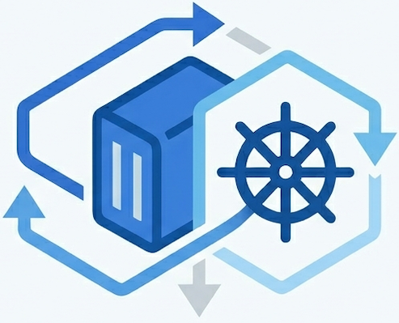

#  Architecture

This document describes the internal design of the Synology Proxy Operator.

---

## Overview

The operator follows the standard Kubernetes controller pattern: it watches resources, computes desired state, and reconciles the difference. There are three controllers and one sync point.

```
Service/Ingress  ──annotation──▶  ServiceIngressReconciler  ──▶┐
ArgoCD App       ──annotation──▶  ArgoApplicationReconciler ──▶├──▶ SynologyProxyRule CRD
Manual resource  ──────────────────────────────────────────────┘
                                                                        │
                                                                        ▼
                                                         SynologyProxyRuleReconciler
                                                                        │
                                          ┌─────────────────────────────┼──────────────────────────┐
                                          ▼                             ▼                          ▼
                                  Discover backend              Upsert DSM proxy           Assign certificate
                                  (Service/Ingress IP)          record via WebAPI           (CN/SAN or default)
```

### Design principles

- **Single DSM call point.** Only `SynologyProxyRuleReconciler` talks to DSM. The other two controllers are purely Kubernetes-side.
- **Idempotency via `description`.** DSM proxy records have no stable external ID across sessions. The operator uses the `description` field as the idempotency key — records are looked up, compared, and updated by description, not UUID.
- **Finalizer-driven cleanup.** Every `SynologyProxyRule` gets a finalizer (`proxy.synology.io/finalizer`) before any DSM write. Deletion of the CR triggers DSM cleanup before the finalizer is removed.
- **Minimal dependencies.** ArgoCD support uses a local type definition (`internal/argo/types.go`) rather than importing the full ArgoCD module. The watcher is disabled gracefully at startup if ArgoCD CRDs are not present.

---

## Controllers

### ServiceIngressReconciler

**File:** `internal/controller/serviceingress_controller.go`

Watches Services and Ingresses with the annotation `synology.proxy/enabled: "true"`. Uses an adapter pattern internally — `serviceReconcileAdapter` and `ingressReconcileAdapter` share a common `reconcileObject()` function.

**Behaviour:**
- Creates a `SynologyProxyRule` in `RULE_NAMESPACE` when an annotated object appears
- Updates the rule spec only when it has changed (equality check before write)
- Deletes the rule when the annotation is removed or the object is deleted

**Reads annotations:** `source-host`, `acl-profile`, `destination-protocol`, `assign-certificate`

---

### ArgoApplicationReconciler

**File:** `internal/controller/argoapplication_controller.go`

Watches ArgoCD `Application` objects (GVK: `argoproj.io/v1alpha1/Application`). Disabled gracefully at startup if ArgoCD CRDs are absent — no restart needed when they appear.

**Behaviour:**
- Creates a `SynologyProxyRule` in `RULE_NAMESPACE` when an annotated Application appears
- Sets `spec.managedByApp` to the Application name for ownership tracking
- Reads `service-ref` and `ingress-ref` annotations to build explicit backend references
- Auto-scans the Application's destination namespace when no refs are provided

**Namespace filtering:** `WATCH_NAMESPACE` restricts which namespaces are observed.

---

### SynologyProxyRuleReconciler

**File:** `internal/controller/synologyproxyrule_controller.go`

The only controller that calls DSM. Reconciles every `SynologyProxyRule` object cluster-wide.

**Reconcile loop:**

```
Reconcile(rule)
  ├── if DeletionTimestamp set → reconcileDelete()
  │     ├── for each managed record: DeleteProxyRecord()
  │     │     └── on error: keep record in status, requeue
  │     └── RemoveFinalizer() — only after all DSM deletes succeed
  └── else → reconcileUpsert()
        ├── AddFinalizer() if missing
        ├── resolveDestination() — discovery chain
        ├── resolveACLProfile() — cached, 5-min TTL
        ├── for each hostname (primary + additionalSourceHosts):
        │     ├── UpsertProxyRecord() — create or update DSM record
        │     └── if written: AssignCertificate()
        ├── reconcile stale records (deleted from spec) → DeleteProxyRecord()
        │     └── on error: keep in status, requeue
        └── update status.ManagedRecords + conditions
```

**Requeue:** every 30 seconds (`requeueAfter`) to catch external DSM drift.

---

## Backend discovery chain

When `spec.destinationHost` is not set, the operator resolves the backend in this order:

1. `spec.serviceRef` → reads the `ExternalIP` of the referenced LoadBalancer Service
2. `spec.ingressRef` → reads the status IP of the referenced Ingress
3. Auto-scan → searches the rule's namespace for the first LoadBalancer Service with an ExternalIP

Discovery result is written to `status.resolvedDestinationHost` and `status.resolvedDestinationPort`.

---

## Synology client

**Package:** `internal/synology/`

| File | Responsibility |
|---|---|
| `client.go` | HTTP client, cookie jar, SynoToken session management, login/logout |
| `proxy.go` | CRUD for DSM reverse proxy records; `proxyRecordEqual` for idempotency |
| `certificate.go` | List DSM certs, match by CN/SAN (wildcard), assign to proxy record |
| `acl.go` | List ACL profiles, resolve name to UUID |

**Session management:** The DSM WebAPI uses a two-factor token scheme. The client maintains a `sid` (session ID) and `synoToken` (CSRF token) via a cookie jar. Both are required in each API request — `sid` in the form body and `synoToken` in both the `X-SYNO-TOKEN` header and form body. The client transparently re-authenticates when the session expires (error code 119).

**Wire types:** DSM JSON shapes are defined inline in each file (`ProxyEntry`, `ProxyFrontend`, `ProxyBackend`, `Certificate`, `ACLProfile`). Enums use DSM's integer protocol codes (frontend protocol 1 = HTTPS, backend protocol 0 = HTTP, 1 = HTTPS).

**Known DSM API quirks** (see also `docs/local-testing.md`):
- Create/update operations can take up to 2 minutes
- The update method name is `update`, not `set`
- Certificate assignment always requires `old_id: ""`

---

## CRD

**Package:** `api/v1alpha1/`

| File | Contents |
|---|---|
| `synologyproxyrule_types.go` | Spec, status, conditions, print columns, kubebuilder markers |
| `zz_generated.deepcopy.go` | Auto-generated — do not edit |
| `groupversion_info.go` | Schema registration |

**Key design choices:**
- `status.managedRecords` is the source of truth for which DSM records exist. Each entry holds the DSM UUID (for reference), the description (idempotency key), and the source hostname.
- `spec.description` defaults to `<namespace>/<name>` when empty — this prevents cross-namespace collisions when two rules have the same name.
- `spec.additionalSourceHosts` causes one DSM record per hostname. All records are tracked in `status.managedRecords`.

---

## Project structure

```
synology-proxy-operator/
├── api/v1alpha1/                         # CRD type definitions
│   ├── synologyproxyrule_types.go
│   ├── zz_generated.deepcopy.go         # generated — do not edit
│   └── groupversion_info.go
├── cmd/
│   └── main.go                          # entry point — flag/env wiring, manager setup
├── internal/
│   ├── argo/
│   │   └── types.go                     # minimal ArgoCD types (no full dependency)
│   ├── controller/
│   │   ├── annotations.go               # shared annotation key constants
│   │   ├── argoapplication_controller.go
│   │   ├── serviceingress_controller.go
│   │   └── synologyproxyrule_controller.go
│   └── synology/
│       ├── client.go
│       ├── proxy.go
│       ├── certificate.go
│       └── acl.go
├── config/
│   ├── crd/bases/                       # generated CRD manifests
│   ├── rbac/                            # ClusterRole, ClusterRoleBinding, ServiceAccount
│   └── manager/                         # Deployment + ConfigMap
├── helm/
│   └── synology-proxy-operator/
│       ├── Chart.yaml
│       ├── values.yaml
│       ├── crds/                        # CRD copy for Helm packaging
│       └── templates/
├── hack/
│   └── dev/                             # local dev fixtures (namespace, nginx, proxy rule, ArgoCD app)
├── docs/
│   ├── architecture.md                  # this file
│   ├── development.md
│   ├── local-testing.md
│   └── release.md
└── .github/workflows/
    ├── ci.yaml                          # PR gates + :main image on main merge
    └── release.yaml                     # semver tag → multi-arch image + Helm release
```
